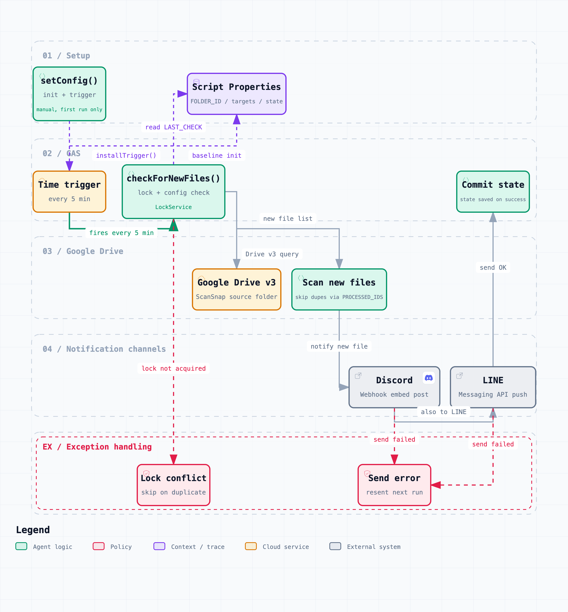

# ScanSnap Notifier (GAS + clasp)

A Google Apps Script project that sends push notifications via the LINE Messaging API when a new file is added to a specific Google Drive folder (for example, a ScanSnap destination). It is managed and deployed locally with clasp.

## Workflow diagram

The full flow from setup through periodic scanning, notification, and state updates. Click the image to open the interactive version (theme switching / zoom / search / relationship tracing).

[](docs/archify/scansnap-notifier-flow.html)

- [Interactive diagram (HTML)](docs/archify/scansnap-notifier-flow.html)
- [Diagram spec (JSON)](docs/archify/scansnap-notifier-workflow.json) — regenerate: `archify deliver workflow docs/archify/scansnap-notifier-workflow.json docs/archify/scansnap-notifier-flow.html --quality showcase`

## Features / How it works

- Notifies only about new files: on the first run it sets the baseline to the current time, so existing files are not notified.
- Scans every 5 minutes: a time-driven trigger runs every 5 minutes to detect new files.
- Notifies LINE: sends the file name, creation time, size, and link as plain text.
- Idempotency: keeps up to 200 recently processed file IDs.
- Execution time budget: if a single run exceeds 4 minutes (`MAX_RUN_MS`), it stops sending, saves its state, and exits. The remainder is deferred to the next run, which prevents the GAS 6-minute limit from force-terminating the run and causing duplicate posts.

## Directory layout

- `src/Code.gs`: main script
- `src/appsscript.json`: manifest (Advanced Drive v3 / OAuth scopes)
- `test/`: behavior tests for `src/Code.gs` (`bun test`)
- `scripts/check-gas.mjs`: static checks (`bun run check`)
- `.clasp.example.json`: sample clasp config (`.clasp.json` is git-ignored)

## Prerequisites

1. Prepare a LINE Messaging API channel access token and a destination ID. See "Setting up the LINE Messaging API" below for details.
2. Find the ID of the Google Drive folder to watch (the `folders/<ID>` part of its URL).
3. Install Node.js and `@google/clasp` beforehand.

## Initial clasp setup

1. Log in
   - `clasp login`
2. Prepare `.clasp.json` (not tracked by git in this repository)
   - PowerShell example: `Copy-Item .clasp.example.json .clasp.json`
   - Replace `scriptId` in `.clasp.json` with your own script ID
   - If you do not have a script yet, create one:
     `clasp create --type standalone --title "ScanSnap Notifier" --rootDir ./src`
3. Push the code and manifest
   - `clasp push`
4. Open the script editor (for inspection)
   - `clasp open`

## Verification

### Static checks

Checks GAS code syntax, duplicate top-level identifiers, and simple undefined global references.

```sh
bun run check
```

### Behavior tests

These pin down the retry branches of `fetchWithRetry` (503 retry, `Retry-After` respect, sleep budget cap, immediate throw on `fatalCodes`) and the state management of `checkForNewFiles` (no duplicate posts on transient failure, LINE failures are logged only while the state is still saved, and hitting the 4-minute execution budget leaves the remainder for the next run). `test/gas-harness.mjs` replaces the GAS APIs with stubs, so you do not need to prepare throwaway stubs outside the repository.

```sh
bun test
```

After editing `src/Code.gs`, pass both `bun run check` and `bun test` (CI runs these two as well).

## GAS configuration

1. Set script properties
   - `FOLDER_ID`: ID of the folder to watch (required)
   - `LINE_CHANNEL_ACCESS_TOKEN`: LINE Messaging API channel access token (required)
   - `LINE_TARGET_ID`: LINE destination ID (user / group / room) (required)
   - Add them under "Project Settings" → "Script Properties" in the Apps Script editor (Japanese UI: 「プロジェクトの設定」→「スクリプト プロパティ」)
   - Conditions for enabling notifications:
     - LINE: sent when both `LINE_CHANNEL_ACCESS_TOKEN` and `LINE_TARGET_ID` are set
     - If they are unset, `setConfig()` raises an error.
2. Run the initialization
   - Select `setConfig` in the editor's function dropdown and click "Run"
   - The first run saves the baseline (current time) and sets a 5-minute trigger
3. Verify behavior
   - First run `validateSetup` and check `ready` and `warnings` in the execution log (if something is unset or the trigger is missing, the reason is printed)
   - Then run `checkForNewFiles` manually as needed and check for errors

## How it works (main functions)

- `setConfig()`: validates the script properties, saves the baseline, and registers the trigger
- `installTrigger()`: maintains exactly one trigger that runs `checkForNewFiles` every 5 minutes
- `checkForNewFiles()`: lists files created since the previous check via Drive v3 and notifies LINE. If a single run exceeds 4 minutes (`MAX_RUN_MS`), it stops sending, saves its state, and exits (the remainder is deferred to the next run)
- `postToLine()`: sends a push to the LINE Messaging API (with 429/5xx retries, up to 5 messages per call; sleep per push is capped at `MAX_RETRY_SLEEP_MS` = 30 seconds)
- `validateSetup()`: validates the script properties and trigger state and prints `ready` / `warnings` / `config` to the execution log (first-line diagnosis when notifications do not arrive)

## Required permissions / scopes

- Read Drive metadata: `https://www.googleapis.com/auth/drive.metadata.readonly`
- External requests (LINE Messaging API): `https://www.googleapis.com/auth/script.external_request`
- Script properties / triggers: `https://www.googleapis.com/auth/script.scriptapp`

These are already defined in `src/appsscript.json`. Drive v3 is enabled as an advanced service. LINE also relies on the `script.external_request` scope, so no additional scope definitions are needed.

## Setting up the LINE Messaging API

> **Note**: The legacy LINE Notify was discontinued in March 2025, so this project uses the LINE Messaging API (push messages via an official account).

1. Create a provider and a Messaging API channel in [LINE Developers](https://developers.line.biz/)
2. Issue a channel access token under "Messaging API settings" for the channel and note it down
3. Add the official account as a friend from the LINE account that should receive notifications (yourself or a family group)
4. Find the destination ID:
   - Individual user: the `userId` obtained via webhook by sending a message to the official account, and so on
   - Group / room: invite the official account to the group, then see "Group / room ID" on the same page
5. Add `LINE_CHANNEL_ACCESS_TOKEN` and `LINE_TARGET_ID` to the Apps Script script properties

### LINE caveats

- The free tier (Light Plan) allows up to 1,000 messages per month. Beyond that you either pay as you go or sending is restricted, so keep an eye on the notification frequency
- The `push` API only reaches users who have added the account as a friend. Sending to non-friends fails
- To send to a group / room, invite the official account to that room first
- Rotating the access token periodically is recommended (reissue it immediately if it leaks)

## Operational notes

- No notifications are sent until `setConfig()` has been run for the first time.
- Notification links are `webViewLink`. Whether a file can be opened depends on its sharing permissions.
- Avoid duplicate folder names and always specify the watch target by folder ID.

## Troubleshooting

- No notifications: run `validateSetup` first and check `ready` / `warnings` in the execution log. If `warnings` states the reason something is unset, fix it accordingly (if `ready` is `true` but nothing arrives, check the items below).
- Nothing reaches LINE: recheck `LINE_CHANNEL_ACCESS_TOKEN` / `LINE_TARGET_ID` and whether the official account has been added as a friend. Check whether `LINE への通知に失敗しました` (failed to notify LINE) appears in the execution log.
- LINE 401 Unauthorized: the channel access token is invalid or expired. Reissue it and update the script properties.
- LINE 400 Bad Request: `LINE_TARGET_ID` is invalid, or the official account has not been added as a friend. Check the ID type (user / group / room).
- Nothing arrives on LINE (no error): check whether you have reached the free tier's 1,000 messages per month.
- Notifications arrive late and in a batch: when LINE returns 429, the run is cut off by the 4-minute budget and the rest goes to the next run 5 minutes later. `実行時間予算 ... を使い切った` (execution time budget ... exhausted) appears in the execution log.
- Existing files were notified: run `setConfig()` again to update `LAST_CHECK` to the current time.
- Want more frequent notifications: you can change `everyMinutes(5)` for the `installTrigger()` interval in the code (mind the execution quota).
